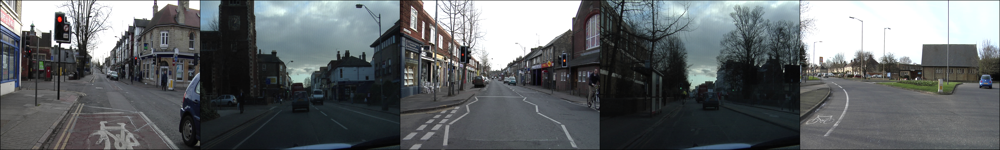

[](https://github.com/ellerbrock/open-source-badges/)

## 🚘 The easiest implementation of fully convolutional networks

- Task: __semantic segmentation__, it's a very important task for automated driving

- The model is based on CVPR '15 best paper honorable mentioned [Fully Convolutional Networks for Semantic Segmentation](https://arxiv.org/abs/1411.4038)

## Results
### Trials
</img>

### Training Procedures
</img>


## Performance

I train with two popular benchmark dataset: CamVid and Cityscapes

|dataset|n_class|pixel accuracy|
|---|---|---
|Cityscapes|20|96%
|CamVid|32|93%

## Training

### Install packages
```bash
pip3 install -r requirements.txt
```

and download pytorch 0.2.0 from [pytorch.org](pytorch.org)

and download [CamVid](http://mi.eng.cam.ac.uk/research/projects/VideoRec/CamVid/) dataset (recommended) or [Cityscapes](https://www.cityscapes-dataset.com/) dataset

### Run the code
- default dataset is CamVid

create a directory named "CamVid", and put data into it, then run python codes:
```python
python3 python/CamVid_utils.py 
python3 python/train.py CamVid
```

- or train with CityScapes

create a directory named "CityScapes", and put data into it, then run python codes:
```python
python3 python/CityScapes_utils.py 
python3 python/train.py CityScapes
```

## Author
Po-Chih Huang / [@pochih](https://pochih.github.io/)
